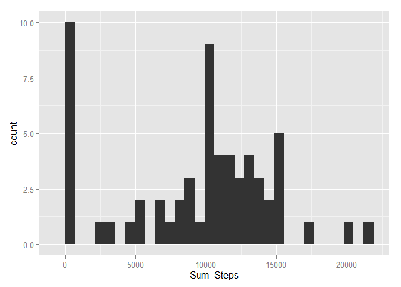
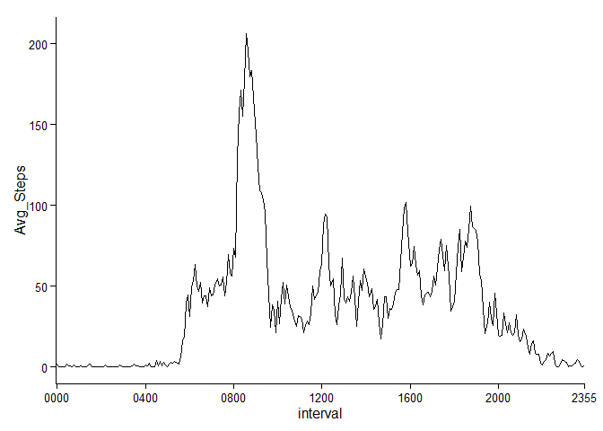
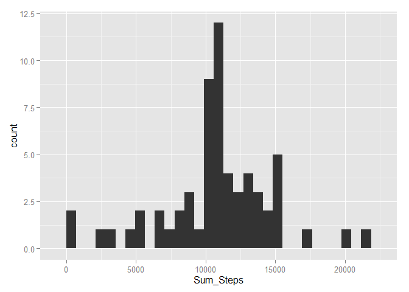
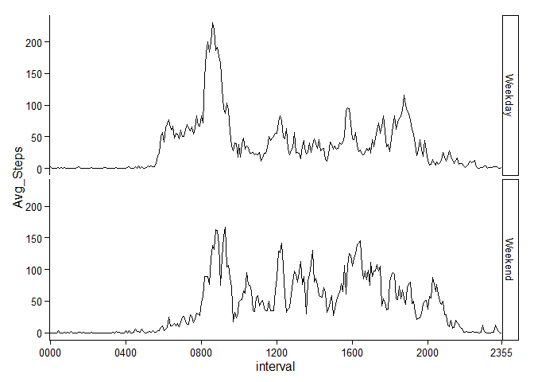

# Reproducible Research: Peer Assessment 1
Berten Van Herp  
July 13, 2015  
### Loading necessary packages
Firstly we are going to install the packages we need for this analysis.

```r
library(dplyr)
library(ggplot2)
library(lubridate)
```

```
## Warning: package 'lubridate' was built under R version 3.2.1
```


### Loading and preprocessing the data
We are going to load in the data in. ADS stands for Activity Data Set. 


```r
ADS <- "activity.zip" %>%
        unzip() %>%
        read.csv(na.strings = "NA")
```

Next we need to take a look at the data and the structure of the data


```r
head(ADS)
```

```
##   steps       date interval
## 1    NA 2012-10-01        0
## 2    NA 2012-10-01        5
## 3    NA 2012-10-01       10
## 4    NA 2012-10-01       15
## 5    NA 2012-10-01       20
## 6    NA 2012-10-01       25
```

```r
str(ADS)
```

```
## 'data.frame':	17568 obs. of  3 variables:
##  $ steps   : int  NA NA NA NA NA NA NA NA NA NA ...
##  $ date    : Factor w/ 61 levels "2012-10-01","2012-10-02",..: 1 1 1 1 1 1 1 1 1 1 ...
##  $ interval: int  0 5 10 15 20 25 30 35 40 45 ...
```

There are a lot of NA's in this data-set, so we must be careful when analyzing. We also see that the interval is actually hours:minutes. So we will make the interval of time-type.


```r
ADS$date <- ymd(ADS$date)
ADS$interval <- format( seq.POSIXt(as.POSIXct(Sys.Date()), by = "5 min", length.out = 288),"%H%M", tz = "GMT")
```


### What is mean total number of steps taken per day?
Important note in the assignment: _For this part of the assignment, you can ignore the missing values in the dataset._

#### Calculate the total number of steps taken per day


```r
ADS_DAY <- ADS %>%
        group_by(date) %>%
        summarise(Sum_Steps = sum(steps, na.rm = TRUE))
```

Lets look at the table:


```r
head(ADS_DAY)
```

```
## Source: local data frame [6 x 2]
## 
##         date Sum_Steps
## 1 2012-10-01         0
## 2 2012-10-02       126
## 3 2012-10-03     11352
## 4 2012-10-04     12116
## 5 2012-10-05     13294
## 6 2012-10-06     15420
```

This looks OK.

#### Make a histogram of the total number of steps taken each day
We will use the ggplot2 package for making the plot.


```r
p <- (ggplot(ADS_DAY,aes(x = Sum_Steps))
    + geom_histogram()
)
print(p)
```

```
## stat_bin: binwidth defaulted to range/30. Use 'binwidth = x' to adjust this.
```

 

#### Calculate and report the mean and median of the total number of steps taken per day


```r
c(summarise(ADS_DAY,mean(Sum_Steps)),summarise(ADS_DAY,median(Sum_Steps)))
```

```
## $`mean(Sum_Steps)`
## [1] 9354.23
## 
## $`median(Sum_Steps)`
## [1] 10395
```


### What is the average daily activity pattern?

#### Make a time series plot of the 5-minute interval (x-axis) and the average number of steps taken, averaged across all days (y-axis)
First we must construct the correct data-frame for this analysis.


```r
ADS_INT <- ADS %>%
        group_by(interval) %>%
        summarise(Avg_Steps = mean(steps, na.rm = TRUE))
```

We try to plot this time-series:


```r
p <- (ggplot(ADS_INT,aes(interval, Avg_Steps,group = 1))
    + geom_line()
    + theme_classic()
    + scale_x_discrete(breaks = c("0000","0400","0800","1200","1600","2000","2355"))
    )
print(p)
```

 

As you can see, I manually adjusted the breaks for a plot that is more readable.

#### Which 5-minute interval, on average across all the days in the dataset, contains the maximum number of steps?
Thanks to the dplyr package, this is only one line of code:

```r
ADS_INT %>% arrange(desc(Avg_Steps)) %>% head(1)
```

```
## Source: local data frame [1 x 2]
## 
##   interval Avg_Steps
## 1     0835  206.1698
```


### Imputing missing values
#### Calculate and report the total number of missing values in the dataset (i.e. the total number of rows with NAs)
This is again a fairly simple piece of code.


```r
ADS %>% filter(!complete.cases(.)) %>% nrow
```

```
## [1] 2304
```

#### Devise a strategy for filling in all of the missing values in the dataset. The strategy does not need to be sophisticated. For example, you could use the mean/median for that day, or the mean for that 5-minute interval, etc.

We will use the Mean number of steps for that interval

This way we will get a pattern that is closer to the real pattern.
We won't take the median for a day, because the night is distorting the data to much then.

#### Create a new dataset that is equal to the original dataset but with the missing data filled in.

We don't need to construct an additional data-frame as we have already calculated this for a previous plot.

Now we join the two data-frames to create the "imputed" table.

```r
IMP_ADS <- ADS %>% 
    inner_join(ADS_INT) %>%
    group_by(interval) %>%
    mutate(Imp_Steps = ifelse(is.na(steps), mean(Avg_Steps), steps))
```

We look if the values are imputed correctly:

```r
head(IMP_ADS)
```

```
## Source: local data frame [6 x 5]
## Groups: interval
## 
##   steps       date interval Avg_Steps Imp_Steps
## 1    NA 2012-10-01     0000 1.7169811 1.7169811
## 2    NA 2012-10-01     0005 0.3396226 0.3396226
## 3    NA 2012-10-01     0010 0.1320755 0.1320755
## 4    NA 2012-10-01     0015 0.1509434 0.1509434
## 5    NA 2012-10-01     0020 0.0754717 0.0754717
## 6    NA 2012-10-01     0025 2.0943396 2.0943396
```

This looks correct!

#### Make a histogram of the total number of steps taken each day and Calculate and report the mean and median total number of steps taken per day. Do these values differ from the estimates from the first part of the assignment? What is the impact of imputing missing data on the estimates of the total daily number of steps?

We first make the corrected data-frame.


```r
ADS_IMP_DAY <- IMP_ADS %>%
        group_by(date) %>%
        summarise(Sum_Steps = sum(Imp_Steps, na.rm = TRUE))
```

And now we plot the histogram

```r
p <- (ggplot(ADS_IMP_DAY,aes(x = Sum_Steps))
    + geom_histogram()
)
print(p)
```

```
## stat_bin: binwidth defaulted to range/30. Use 'binwidth = x' to adjust this.
```

 

And we recalculate the median and the mean.

```r
c(summarise(ADS_IMP_DAY,mean(Sum_Steps)),summarise(ADS_IMP_DAY,median(Sum_Steps)))
```

```
## $`mean(Sum_Steps)`
## [1] 10766.19
## 
## $`median(Sum_Steps)`
## [1] 10766.19
```

### Are there differences in activity patterns between weekdays and weekends?

#### Create a new factor variable in the dataset with two levels - "weekday" and "weekend" indicating whether a given date is a weekday or weekend day.

The following code takes care of this and filters away the unnecessary columns.

```r
Basetable <- IMP_ADS %>%
            mutate(Dag = weekdays(date, abbreviate = TRUE)) %>%
            mutate(WeekdayOrWeekend = ifelse(Dag %in% c("za", "zo"), "Weekend","Weekday")) %>%
            select(date,interval,Imp_Steps,WeekdayOrWeekend)
```

#### Make a panel plot containing a time series plot (i.e. type = "l") of the 5-minute interval (x-axis) and the average number of steps taken, averaged across all weekday days or weekend days (y-axis).

First we need to create the dataframe.

```r
Base_WoW <- Basetable %>%
            group_by(WeekdayOrWeekend,interval) %>%
            summarise(Avg_Steps = mean(Imp_Steps))
```

And now we can finally plot the panelplot.

```r
p <- (ggplot(Base_WoW,aes(interval, Avg_Steps,group = WeekdayOrWeekend ))
    + geom_line()
    + facet_grid(WeekdayOrWeekend ~ .)
    + theme_classic()
    + scale_x_discrete(breaks = c("0000","0400","0800","1200","1600","2000","2355"))
    )
print(p)
```

 

### Thanks for reading till the end!
